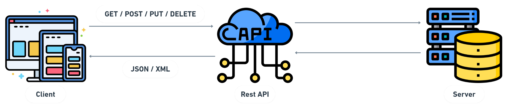

<p align="center">
  
</p><br />

## API Request em Node.js

- Uma API Request em node.js para cadastro de produtos.

<br />

<p align="center">
  <a href="#features"> :newspaper: Features</a>&nbsp;&nbsp;|&nbsp;&nbsp;
  <a href="#requisitos">:pushpin: Pré-requisitos</a>&nbsp;&nbsp;|&nbsp;&nbsp;
  <a href="#tecnologias">:computer: Tecnologias</a>&nbsp;&nbsp;|&nbsp;&nbsp;
  <a href="#rodando"> :arrow_forward: Rodando o Projeto</a>&nbsp;&nbsp;|&nbsp;&nbsp;
  <a href="#contribuir"> :jigsaw: Como Contribuir</a>&nbsp;&nbsp;|&nbsp;&nbsp;
  <a href="#licenca"> :memo: Licença</a>
</p>

<br />

<div id="features" align="center">
  <h2> :newspaper: Features</h2>
</div>

- [x] Usuários:
  - [x] Cadastrar;
  - [x] Deletar;
  - [x] Realiza Login;
  - [x] Visualizar.
- [x] Categorias:
  - [x] Atualizar;
  - [x] Cadastrar;
  - [x] Deletar;
  - [x] Exibir;
  - [x] Visualizar.
- [x] Produtos:
  - [x] Atualizar;
  - [x] Cadastrar;
  - [x] Deletar;
  - [x] Exibir;
  - [x] Visualizar.
- [x] Pedidos:
  - [x] Cadastrar;
  - [x] Deletar;
  - [x] Exibir;
  - [x] Visualizar.

<br />

<div id="requisitos" align="center">
  <h2> :pushpin: Pré-requisitos</h2>
</div>

- [Git](https://git-scm.com)
- [Laragon](https://laragon.org/) ou [XAMPP](https://www.apachefriends.org/)
- [MySQL](https://www.mysql.com/)
- [Node.JS](https://nodejs.org/)
- [Npm](https://www.npmjs.com/)
- [Postman](https://www.postman.com/)
- [VSCode](https://code.visualstudio.com/)

<br />

<div id="tecnologias" align="center">
  <h2> :computer: Tecnologias</h2>
</div>

- Esse projeto foi desenvolvido com as seguintes tecnologias:
  - JavaScript;
  - MySQL;
  - Node.JS.

<br />

<div id="rodando" align="center">
  <h2> :arrow_forward: Rodando o Projeto</h2>
</div>

<div id="#" align="center">
  <h4>
    Siga os seguintes passos para instalar:
  </h4>
</div>

```bash
# clonando o projeto na sua maquina
$ git clone https://github.com/ThaiMedeiros/apiRestNodeJs.git

# entre na pasta do projeto
$ cd apiRestNodeJs

# instale as dependências através do comando:
$ `npm install`

# execute seu servidor de banco de dados MySQL
$ execute o **laragon** ou **xampp** (ou outro servidor web)

# logo após a inicialização, acesse no browser:
$ http://localhost://phpmyadmin (então crie um novo banco de dados)

# crie um banco de dados chamado:
$ testeapi

# após a criação, importe o arquivo que está na pasta:
$ banco_de_dados

# para rodar a aplicação, vá novamente a raiz e digite o seguinte comando:
$ `npm start`

# após a aplicação rodando, recomendo utilizar o >> Postman << para fazer as requisições.
# dentro da pasta: >> collection_postman <<, estão todas as requisições da API configuradas.

# poderá acessá-lo através do endereço:
$ `localhost:3000`
```

<br />

**Observações:**

- Caso a pasta de **upload** não exista, crie-a na raiz.
- Após importar a collection no postman, caso a variável url esteja sem o valor padrão: (localhost:3000), siga os seguintes passos:
  - **(essas configurações são opcionais)**

1. Passe o mouse em cima, e clique nos 3 (...) ao lado do nome e vá na opção: **Edit**
2. Logo após, no menu superior, clique na opção: **Variables**
3. Em variables, crie uma chamada: **url** e no initial value e em current value insira: **localhost:3000** ou a localização da url padrão onde você está executando a aplicação.
4. Pronto, suas variáveis de ambiente estão criadas. Isso poupa-lhes tempo de ficar digitando a url inteira, além de viualmente deixá-la mais "enxuta", já que algumas são grandes.

<br />

<div id="contribuir" align="center">
    <h2> :jigsaw: Como Contribuir</h2>
</div>

1. Faça um fork desse projeto.
2. Crie uma nova branch para trabalhar: `git checkout -b my-feature`
3. Faça commit da sua feature: `git commit -m "feature: My new feature"`
4. Envie as suas alterações: `git push origin my-feature`
5. Solicite uma Pull Request para o diretório original.

<br />

<div id="licenca" align="center">
    <h2> :memo: Licença</h2>
</div>

Esse projeto está sob a licença :balance_scale: MIT License. Veja o arquivo [LICENSE](LICENSE) para mais detalhes.

---

Desenvolvido por: :copyright: Thaiza Medeiros :woman_technologist: :purple_heart:
